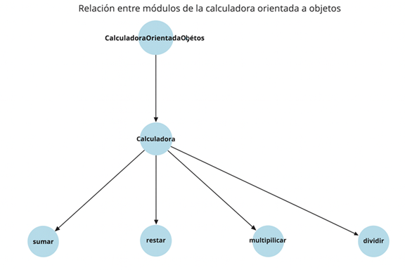

# Modularidad, Herencia y Reusabilidad

## Definiciones y ejemplos ilustrativos

### Tipos primitivos - paso por valor

```java
public class PasoPorValorPrimitivo {
    public static void main(String[] args) {
        int numero = 10;
        cambiarValor(numero);
        System.out.println("Valor después de llamar al método: " + numero); // Imprime 10
    }

    public static void cambiarValor(int valor) {
        valor = 20; // Esta modificación no afecta a 'numero' en el método main
    }
}
// En los tipos de datos primitivos se pasa una copia del valor.
```
<details>
<summary>💡 Paso de parámetros</summary>
<p>En los tipos de datos primitivos se pasa una copia del valor. </p>
</details>

### Objetos - paso por referencia

```java
public class PasoPorValorReferencia {
    public static void main(String[] args) {
        MiObjeto objeto = new MiObjeto();
        objeto.valor = 10;

        modificarObjeto(objeto);
        System.out.println("Valor después de llamar al método: " + objeto.valor); // Imprime 20
    }

    public static void modificarObjeto(MiObjeto obj) {
        obj.valor = 20; // Modifica el valor del objeto original
    }
}

class MiObjeto {
    int valor;
}

```
<details>
<summary>💡 Paso de parámetros</summary>
<p>En los objtos se pasa una copia de la referncia, por lo que ambos apuntan al mismo objeto. 
Esto permite modificar el objeto original a través de la referencia. </p>
</details>
---

### Paso por referencia. Ejemplo.

```java
public class ReferenciaEjemplo {
    public static void main(String[] args) {
        // Creamos un objeto de la clase String
        String mensaje = "Hola, mundo";
        
        // Creamos otra referencia que apunta al mismo objeto
        String otraReferencia = mensaje;

        // Mostramos el contenido de ambas referencias
        System.out.println("Mensaje original: " + mensaje);
        System.out.println("Otra referencia: " + otraReferencia);

        // Modificamos la referencia 'mensaje'
        mensaje = "Nuevo mensaje";

        // Mostramos el contenido después de la modificación
        System.out.println("Mensaje después de modificar: " + mensaje);
        System.out.println("Contenido de otra referencia: " + otraReferencia);
    }
}
```
---
### Calculadora secuencial

```java
import java.util.Scanner;

public class CalculadoraSecuencial {
    public static void main(String[] args) {
        Scanner scanner = new Scanner(System.in);

        // Solicitar el primer número
        System.out.println("Ingrese el primer número:");
        double num1 = scanner.nextDouble();

        // Solicitar el segundo número
        System.out.println("Ingrese el segundo número:");
        double num2 = scanner.nextDouble();

        // Solicitar la operación a realizar
        System.out.println("Ingrese la operación (+, -, *, /):");
        char operacion = scanner.next().charAt(0);

        // Variable para almacenar el resultado
        double resultado = 0;

        // Realizar la operación
        switch (operacion) {
            case '+':
                resultado = num1 + num2;
                break;
            case '-':
                resultado = num1 - num2;
                break;
            case '*':
                resultado = num1 * num2;
                break;
            case '/':
                if (num2 != 0) {
                    resultado = num1 / num2;
                } else {
                    System.out.println("Error: División por cero no permitida.");
                    return;
                }
                break;
            default:
                System.out.println("Operación no válida.");
                return;
        }

        // Mostrar el resultado
        System.out.println("El resultado es: " + resultado);
    }
}
```
---

### Calculadora orientada a objetos

```java
import java.util.Scanner;

// Clase Calculadora con los métodos para cada operación
class Calculadora {
    // Método para sumar
    public double sumar(double a, double b) {
        return a + b;
    }

    // Método para restar
    public double restar(double a, double b) {
        return a - b;
    }

    // Método para multiplicar
    public double multiplicar(double a, double b) {
        return a * b;
    }

    // Método para dividir
    public double dividir(double a, double b) {
        if (b == 0) {
            System.out.println("Error: División por cero no permitida.");
            return 0; // O lanzar una excepción dependiendo del caso
        }
        return a / b;
    }
}

public class CalculadoraOrientadaObjetos {
    public static void main(String[] args) {
        Scanner scanner = new Scanner(System.in);
        Calculadora calculadora = new Calculadora();

        // Solicitar el primer número
        System.out.println("Ingrese el primer número:");
        double num1 = scanner.nextDouble();

        // Solicitar el segundo número
        System.out.println("Ingrese el segundo número:");
        double num2 = scanner.nextDouble();

        // Solicitar la operación a realizar
        System.out.println("Ingrese la operación (+, -, *, /):");
        char operacion = scanner.next().charAt(0);

        // Variable para almacenar el resultado
        double resultado = 0;

        // Realizar la operación mediante los métodos de la clase Calculadora
        switch (operacion) {
            case '+':
                resultado = calculadora.sumar(num1, num2);
                break;
            case '-':
                resultado = calculadora.restar(num1, num2);
                break;
            case '*':
                resultado = calculadora.multiplicar(num1, num2);
                break;
            case '/':
                resultado = calculadora.dividir(num1, num2);
                break;
            default:
                System.out.println("Operación no válida.");
                return;
        }

        // Mostrar el resultado
        System.out.println("El resultado es: " + resultado);
    }
}

```
<details>
<summary>💡 Detalles</summary>
<p>La clase Calculadora encapsula toda la lógica de las operaciones matemáticas. Esto significa que la funcionalidad está agrupada en un único lugar y separada de otras partes del programa (como la entrada y salida de datos en el main). </p>
<p><strong>Ventaja</strong> Si un módulo (la clase Calculadora) tiene un fallo o necesita ser mejorado, es fácil modificarlo sin afectar a otras partes del código. Esto facilita la <strong>localización de errores</strong> y la <strong>evolución del software</strong>.</p>
</details>
---

### Calculadora orientada a objetos - potencia

```java
// Aprovechamos la modularidad incluyendo el método potencia en la clase calculadora
// de esta forma se pueden agregar nuevas funcionalidades sin alterar significativamente
// la estructura del programa.

import java.util.Scanner;

// Clase Calculadora con los métodos para cada operación
class Calculadora {
    // Método para sumar
    public double sumar(double a, double b) {
        return a + b;
    }

    // Método para restar
    public double restar(double a, double b) {
        return a - b;
    }

    // Método para multiplicar
    public double multiplicar(double a, double b) {
        return a * b;
    }

    // Método para dividir
    public double dividir(double a, double b) {
        if (b == 0) {
            System.out.println("Error: División por cero no permitida.");
            return 0; // O lanzar una excepción dependiendo del caso
        }
        return a / b;
    }

    // Nuevo método para calcular la potencia
    public double potencia(double base, double exponente) {
        return Math.pow(base, exponente);
    }
}

public class CalculadoraOrientadaObjetosPotencia {
    public static void main(String[] args) {
        Scanner scanner = new Scanner(System.in);
        Calculadora calculadora = new Calculadora();

        // Solicitar el primer número
        System.out.println("Ingrese el primer número:");
        double num1 = scanner.nextDouble();

        // Solicitar el segundo número
        System.out.println("Ingrese el segundo número:");
        double num2 = scanner.nextDouble();

        // Solicitar la operación a realizar
        System.out.println("Ingrese la operación (+, -, *, /, ^):");
        char operacion = scanner.next().charAt(0);

        // Variable para almacenar el resultado
        double resultado = 0;

        // Realizar la operación mediante los métodos de la clase Calculadora
        switch (operacion) {
            case '+':
                resultado = calculadora.sumar(num1, num2);
                break;
            case '-':
                resultado = calculadora.restar(num1, num2);
                break;
            case '*':
                resultado = calculadora.multiplicar(num1, num2);
                break;
            case '/':
                resultado = calculadora.dividir(num1, num2);
                break;
            case '^':  // Nueva operación para calcular la potencia
                resultado = calculadora.potencia(num1, num2);
                break;
            default:
                System.out.println("Operación no válida.");
                return;
        }

        // Mostrar el resultado
        System.out.println("El resultado es: " + resultado);
    }
}

```
<details>
<summary>💡 Detalles</summary>
<p>La clase Calculadora puede ser utilizada en otros programas. Si en alún otro sistema es necesario realizar operaciones mátemáticas, se podría integrar fácilmente la clase sin necesidad de reescribir la lógica. </p>
<p><strong>Ventajas:</strong> </p>
<p>- Reutilización. Evita la duplicación de código, lo que mejora la eficiencia y reduce la posibilidad de errores.</p>
<p>- Mantenimiento. Si el código crece o cambia, se puede realizar sin modificar el flujo principal de la aplicación. Además, cualquier corrección que se deba hacer se puede realizar directamente en la clase Calculadora sin tocar otras partes del código. El código estará mejor organizado.</p>
<p>- Flexibilidad. Se puede extender la clase Calculadora sin modificarla directamente, utilizando herencia o composición. Se podría crear una nueva clase, como CalculadoraAvanzada, que extienda la funcionalidad de la calculadora básica, y siga reutilizando el código existente.</p>
<p>- Encapsulamiento. La lógica de cada operación (suma, resta, multiplicación y división) está contenida dentro de métodos privados a la clase Calculadora. Esto significa que el main no necesita saber cómo se implementa cada operación; solo llama a los métodos correspondientes. Al ocultar los detalles internos, el código que interactúa con la clase Calculadora (como el código del main) es más simple y menos propenso a errores. Además, si cambia la implementación interna (por ejemplo, optimizando el cálculo de la multiplicación), el resto del programa no se ve afectado.</p>
<p>- Escalabilidad. La capacidad para adaptarse al crecimiento, tanto en tamaño como en complejidad. : La estructura orientada a objetos es naturalmente más escalable. A medida que el programa crezca (por ejemplo, añadiendo nuevas funciones o integraciones), se pueden mantener las operaciones matemáticas en la clase Calculadora o derivarlas a subclases especializadas sin tener que reestructurar el flujo general del programa.</p>
</details>
---

### Calculadora orientada a objetos - potencia - interfaz

```java
import java.util.Scanner;

// Interfaz Operacion que define un método para ejecutar cualquier operación
interface Operacion {
    double ejecutar(double a, double b);
}

// Clase para sumar
class Suma implements Operacion {
    @Override
    public double ejecutar(double a, double b) {
        return a + b;
    }
}

// Clase para restar
class Resta implements Operacion {
    @Override
    public double ejecutar(double a, double b) {
        return a - b;
    }
}

// Clase para multiplicar
class Multiplicacion implements Operacion {
    @Override
    public double ejecutar(double a, double b) {
        return a * b;
    }
}

// Clase para dividir
class Division implements Operacion {
    @Override
    public double ejecutar(double a, double b) {
        if (b == 0) {
            System.out.println("Error: División por cero no permitida.");
            return 0;
        }
        return a / b;
    }
}

// Clase para potencia
class Potencia implements Operacion {
    @Override
    public double ejecutar(double base, double exponente) {
        return Math.pow(base, exponente);
    }
}

// Clase Calculadora que usa la interfaz Operacion
class Calculadora {
    public double operar(Operacion operacion, double a, double b) {
        return operacion.ejecutar(a, b);
    }
}

public class CalculadoraOrientadaObjetosPotenciaInterfaz {
    public static void main(String[] args) {
        Scanner scanner = new Scanner(System.in);
        Calculadora calculadora = new Calculadora();

        // Solicitar el primer número
        System.out.println("Ingrese el primer número:");
        double num1 = scanner.nextDouble();

        // Solicitar el segundo número
        System.out.println("Ingrese el segundo número:");
        double num2 = scanner.nextDouble();

        // Solicitar la operación a realizar
        System.out.println("Ingrese la operación (+, -, *, /, ^):");
        char operacion = scanner.next().charAt(0);

        // Variable para almacenar el resultado
        double resultado = 0;

        // Definir la operación basada en la entrada
        Operacion op = null;
        switch (operacion) {
            case '+':
                op = new Suma();
                break;
            case '-':
                op = new Resta();
                break;
            case '*':
                op = new Multiplicacion();
                break;
            case '/':
                op = new Division();
                break;
            case '^':
                op = new Potencia();
                break;
            default:
                System.out.println("Operación no válida.");
                return;
        }

        // Realizar la operación mediante la interfaz Operacion
        if (op != null) {
            resultado = calculadora.operar(op, num1, num2);
        }

        // Mostrar el resultado
        System.out.println("El resultado es: " + resultado);
    }
}
```
---

## Diagrama de módulos



## Relación real

- La clase **Calculadora** es una clase independiente que contiene los métodos para realizar las operaciones básicas (suma, resta, multiplicación y división).  
- La clase **CalculadoraOrientadaObjetos** es simplemente la clase principal donde se solicita la entrada del usuario y se utiliza un objeto de la clase **Calculadora** para realizar las operaciones.  

---

## Interacción

La clase **CalculadoraOrientadaObjetos** crea una instancia de **Calculadora** y llama a sus métodos.  
Es un ejemplo de **composición** (usar un objeto dentro de otro) y no de **herencia**.  

---

## Diferencias clave

- **Herencia**: Una clase hija hereda los métodos y propiedades de la clase padre, y puede sobreescribir o extender la funcionalidad de la clase padre.  
- **Composición**: Una clase contiene una instancia de otra clase y utiliza sus métodos, pero no hereda de ella.  

En este caso, la clase principal (**CalculadoraOrientadaObjetos**) utiliza la clase **Calculadora**, pero no es una subclase de ella.  

<details>
<summary>💡 extends</summary>
<p>Solo puedes <strong>extender de UNA sola clase</strong> (Java no permite herencia múltiple de clases).</p>
<p>Heredas atributos y métodos de la superclase.</p>
<p>Puedes <strong>sobrescribir (override)</strong> métodos para dar un comportamiento específico.</p>
<p>Puedes añadir nuevos atributos o métodos.</p>
<p>extends significa: <i>soy un tipo más específico de esa clase</i>.</p>
</details>

---

<details>
<summary>💡 implements</summary>
<p>Una interfaz define un <strong>contrato</strong> (qué métodos debe tener la clase), pero no la implementación.</p>
<p>Una clase puede <strong>implementar varias interfaces</strong> → es la forma de tener <i>herencia múltiple</i> en Java.</p>
<p>Obliga a la clase a implementar todos los métodos declarados en la interfaz (salvo que la clase sea abstracta).</p>
<p>Puedes añadir nuevos atributos o métodos.</p>
<p>implements significa: <i>cumplo el contrato de esta interfaz</i>.</p>
</details>

---

## Conclusión

Esto significa que la relación entre ambas clases es de **uso o colaboración**, y no de herencia.  
