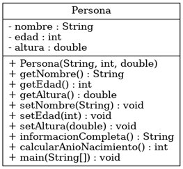
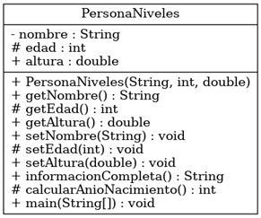

# Modularidad, Herencia y Reusabilidad

## Definiciones y ejemplos ilustrativos

### Métodos: constructores, accesores, transformadores y productores

```java
public class Persona {
    // Atributos privados de la clase
    private String nombre;
    private int edad;
    private double altura;

    // *** Constructor: Se utiliza para inicializar los atributos de la clase cuando se crea un objeto
    public Persona(String nombre, int edad, double altura) {
        this.nombre = nombre;
        this.edad = edad;
        this.altura = altura;
    }

    // *** Método Accesor (getter): Permite acceder al valor del atributo 'nombre'
    public String getNombre() {
        return nombre;
    }

    // *** Método Accesor (getter): Permite acceder al valor del atributo 'edad'
    public int getEdad() {
        return edad;
    }

    // *** Método Accesor (getter): Permite acceder al valor del atributo 'altura'
    public double getAltura() {
        return altura;
    }

    // *** Método Transformador (setter): Permite modificar el valor del atributo 'nombre'
    public void setNombre(String nombre) {
        this.nombre = nombre;
    }

    // *** Método Transformador (setter): Permite modificar el valor del atributo 'edad'
    public void setEdad(int edad) {
        this.edad = edad;
    }

    // *** Método Transformador (setter): Permite modificar el valor del atributo 'altura'
    public void setAltura(double altura) {
        this.altura = altura;
    }

    // *** Método Productor: Crea y devuelve una cadena con la información de la persona
    public String informacionCompleta() {
        return "Nombre: " + nombre + ", Edad: " + edad + " años, Altura: " + altura + " m";
    }

    // *** Método Productor: Calcula el año de nacimiento de la persona basado en su edad
    public int calcularAnioNacimiento() {
        int anioActual = java.util.Calendar.getInstance().get(java.util.Calendar.YEAR);
        return anioActual - edad;
    }

    // Método principal para probar la clase Persona
    public static void main(String[] args) {
        // Creación de un objeto de la clase Persona usando el constructor
        Persona persona = new Persona("Juan", 25, 1.75);

        // Uso de los métodos accesores
        System.out.println("Nombre: " + persona.getNombre());
        System.out.println("Edad: " + persona.getEdad());
        System.out.println("Altura: " + persona.getAltura());

        // Uso de los métodos transformadores
        persona.setNombre("Carlos");
        persona.setEdad(30);
        persona.setAltura(1.80);

        // Mostrar la información completa usando el método productor
        System.out.println("Información actualizada: " + persona.informacionCompleta());

        // Uso de otro método productor
        System.out.println("Año de nacimiento: " + persona.calcularAnioNacimiento());
    }
}
```



<details>
<summary>💡 Características</summary>
<p>Los atributos (nombre, edad, altura) son privados (-).</p>
<p>Todos los métodos son públicos (+).</p>
<p>Esto es un caso clásico de <strong>encapsulación fuerte:</strong></p>
<p>Los datos se ocultan (private).</p>
<p>Se accede a ellos solo a través de getters y setters.</p>
<p>El usuario de la clase no puede manipular directamente los atributos.</p>
</details>

---

### Métodos: constructores, accesores, transformadores y productores

```java
public class PersonaNiveles {
    // Atributos de la clase con diferentes modificadores de acceso
    private String nombre;   // Solo accesible desde dentro de la clase Persona
    protected int edad;      // Accesible desde la clase Persona y sus subclases (en el mismo paquete o diferentes paquetes)
    public double altura;    // Accesible desde cualquier clase

    // *** Constructor público: Se utiliza para inicializar los atributos de la clase cuando se crea un objeto
    public PersonaNiveles(String nombre, int edad, double altura) {
        this.nombre = nombre;
        this.edad = edad;
        this.altura = altura;
    }

    // *** Método Accesor (getter) público: Permite acceder al valor del atributo 'nombre'
    public String getNombre() {
        return nombre;
    }

    // *** Método Accesor (getter) protegido: Permite acceder al valor del atributo 'edad'
    protected int getEdad() {
        return edad;
    }

    // *** Método Accesor (getter) público: Permite acceder al valor del atributo 'altura'
    public double getAltura() {
        return altura;
    }

    // *** Método Transformador (setter) público: Permite modificar el valor del atributo 'nombre'
    public void setNombre(String nombre) {
        this.nombre = nombre;
    }

    // *** Método Transformador (setter) protegido: Permite modificar el valor del atributo 'edad'
    protected void setEdad(int edad) {
        this.edad = edad;
    }

    // *** Método Transformador (setter) público: Permite modificar el valor del atributo 'altura'
    public void setAltura(double altura) {
        this.altura = altura;
    }

    // *** Método Productor público: Crea y devuelve una cadena con la información de la persona
    public String informacionCompleta() {
        return "Nombre: " + nombre + ", Edad: " + edad + " años, Altura: " + altura + " m";
    }

    // *** Método Productor protegido: Calcula el año de nacimiento de la persona basado en su edad
    protected int calcularAnioNacimiento() {
        int anioActual = java.util.Calendar.getInstance().get(java.util.Calendar.YEAR);
        return anioActual - edad;
    }

    // Método principal para probar la clase PersonaNiveles
    public static void main(String[] args) {
        // Creación de un objeto de la clase PersonaNiveles usando el constructor
        PersonaNiveles persona = new PersonaNiveles("Juan", 25, 1.75);

        // Uso de los métodos accesores
        System.out.println("Nombre: " + persona.getNombre());
        System.out.println("Edad: " + persona.getEdad());
        System.out.println("Altura: " + persona.getAltura());

        // Uso de los métodos transformadores
        persona.setNombre("Carlos");
        persona.setEdad(30);
        persona.setAltura(1.80);

        // Mostrar la información completa usando el método productor
        // Genera una cadena completa con la información de la persona

        System.out.println("Información actualizada: " + persona.informacionCompleta());

        // Uso de otro método productor
        // Calcula y devuelve el año de nacimiento basado en la edad
        System.out.println("Año de nacimiento: " + persona.calcularAnioNacimiento());
    }
}

// Nota:
// Aunque el atributo nombre es private, su valor 
//se puede mostrar porque el método getNombre() es public y 
//proporciona un medio autorizado y controlado para acceder a 
//ese valor desde fuera de la clase.
//El uso de atributos private junto con métodos public (getters 
//y setters) es un principio fundamental de encapsulación en la 
//programación orientada a objetos.
```



<details>
<summary>💡 Características</summary>
<p><strong>nombre</strong> es <strong>privado</strong> (-) → solo accesible desde dentro de la clase.</p>
<p><strong>edad</strong> es <strong>protegido</strong> (#) → accesible desde la clase y las subclases..</p>
<p><strong>altura</strong> es <strong>público</strong> (+) → accesible desde cualquier parte del programa.</p>
<p>Lo mismo ocurre con algunos métodos:</p>
<p><strong>getEdad()</strong>, <strong>setEdad()</strong> y <strong>calcularAnioNacimiento()</strong> son <strong>protegidos</strong>.</p>
<p>Los demás <strong>(getNombre()</strong>, <strong>getAltura()</strong>, etc.) son <strong>públicos</strong>.</p>
</details>

---

### Gestión de operaciones

```java
import java.util.Scanner;

// Clase Cilindro para gestionar las operaciones con el cilindro
class Cilindro {
    private double altura;
    private double radio;

    // Método para inicializar los valores de altura y radio
    public void inicializar(double altura, double radio) {
        this.altura = altura;
        this.radio = radio;
    }

    // Método para calcular el volumen del cilindro
    public double calculaVolumen() {
        return Math.PI * Math.pow(radio, 2) * altura;
    }
}

// Clase principal UsaCilindro
public class UsaCilindro {
    public static void main(String[] args) {
        double alt, rad;

        // Creación del objeto Scanner para la entrada de datos
        Scanner teclado = new Scanner(System.in);

        // Solicitar la altura del cilindro
        System.out.print("Introduce la altura: ");
        alt = teclado.nextDouble();

        // Solicitar el radio del cilindro
        System.out.print("Introduce el radio: ");
        rad = teclado.nextDouble();

        // Crear un objeto de la clase Cilindro
        Cilindro c = new Cilindro();
        c.inicializar(alt, rad);

        // Calcular y mostrar el volumen del cilindro
        System.out.println("El volumen del cilindro es: " + c.calculaVolumen());

        // Cerrar el objeto Scanner
        teclado.close();
    }
}
```

<details>
<summary>💡 Detalles </summary>
<p> Detalles. </p>
</details>

