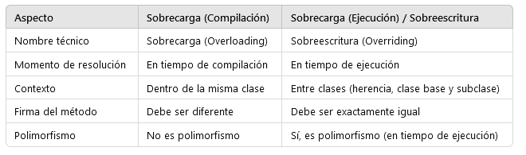

# Modularidad, Herencia y Reusabilidad  -- s4-d1

## Definiciones y ejemplos ilustrativos

### Conceptos fundamentales de la programación orientada a objetos

[Interfaz vs clase](02_interfazvsclase.md)

### Modificadores de acceso

En Java los modificadores de acceso determinan la visibilidad de clases, métodos y atributos:

- **public**: accesible desde cualquier clase, sin importar el paquete.  
- **protected**: accesible desde el mismo paquete y también desde subclases, incluso si están en paquetes diferentes.  
- **package-private** (sin especificar modificador): accesible solo dentro del mismo paquete.  
- **private**: accesible únicamente dentro de la misma clase.  

El uso adecuado de estos modificadores favorece la **encapsulación**, permitiendo controlar qué partes de una clase se exponen y cuáles permanecen ocultas.

### Sobrecarga

En Java, la **sobrecarga de métodos** (method overloading) ocurre cuando dentro de una misma clase existen varios métodos con el **mismo nombre**, pero que se diferencian en el **número o tipo de parámetros** que reciben. Esto permite reutilizar el nombre del método para realizar operaciones similares adaptadas a distintos contextos, mejorando la legibilidad y reduciendo la duplicación de código. La selección de qué método ejecutar no se hace en tiempo de ejecución, sino en **tiempo de compilación**, en función de la lista de parámetros usada en la llamada. Gracias a la sobrecarga, es posible crear clases más flexibles y expresivas, como por ejemplo tener varios métodos `calcularArea()` que acepten cuadrados, círculos o triángulos, sin necesidad de inventar nombres distintos para cada uno.

En Java, la **sobrecarga de métodos** sigue estas reglas principales:

- Los métodos deben tener el **mismo nombre**, pero diferenciarse en el **número o tipo de parámetros**.  
- La sobrecarga se decide en **tiempo de compilación** (no en ejecución).  
- El **tipo de retorno** puede ser distinto, pero no basta para diferenciar métodos por sí solo.  
- Los modificadores de acceso (`public`, `private`, etc.) pueden variar entre métodos sobrecargados.  
- Los parámetros pueden diferir en **cantidad** (`metodo(int)` vs `metodo(int, int)`) o en **tipo** (`metodo(int)` vs `metodo(double)`).  
- Se permite combinar tipos de parámetros para cubrir distintos escenarios de uso.  
- La sobrecarga hace que el código sea **más legible y reutilizable**, evitando nombres diferentes para operaciones similares.  

Ejemplo clásico: tener varios métodos `calcularArea()` para distintas figuras (círculo, cuadrado, triángulo) en una misma clase.



 **[Sobrecarga de métodos](02_codigos3.3.md#sobrecarga-de-metodos)**


### This

En Java, la palabra clave **`this`** se utiliza para referirse al objeto actual dentro de una clase. Es útil para diferenciar atributos de variables locales con el mismo nombre o para invocar otros métodos del propio objeto. Además, puede emplearse en la técnica de **constructor chaining**, usando **`this(...)`** dentro de un constructor para llamar a otro constructor de la misma clase. Esto evita duplicar código y centraliza la inicialización de atributos. Por ejemplo, se puede tener un constructor principal con todos los parámetros y otros constructores más simples que deleguen en él mediante `this(...)`, facilitando la creación de objetos con diferentes niveles de detalle.

En Java, la palabra clave **`this`** tiene varios usos importantes:

#### Uso de `this` en Java

En Java, la palabra clave **`this`** tiene varios usos importantes:

- **Referirse al objeto actual**: permite acceder a los atributos y métodos de la propia instancia.  
  ```java
  this.nombre = nombre; // diferencia entre atributo y parámetro local
  ```

- **Invocar otros métodos de la misma clase**:  
  ```java
  this.calcularEdad();
  ```

- **Pasar el objeto actual como argumento** a otro método o constructor:  
  ```java
  otraClase.procesar(this);
  ```

- **Constructor chaining (`this(...)`)**: dentro de un constructor, `this(...)` invoca a otro constructor de la misma clase.  
  ```java
  public Persona(String nombre) {
      this(nombre, 0); // llama al constructor con dos parámetros
  }
  ```

Esto evita duplicación de código, centraliza la inicialización y hace más flexible la creación de objetos.

**[This](02_codigos3.3.md#this)**

### Estado de los objetos

En programación orientada a objetos, el **estado de un objeto** está definido por los valores que toman sus **atributos** en un momento dado. Dichos atributos describen las características o propiedades del objeto y pueden cambiar a lo largo de la ejecución del programa mediante métodos que los modifican. Así, dos objetos de la misma clase pueden compartir el mismo comportamiento (métodos) pero diferir en su estado si sus atributos almacenan valores distintos. Entender y gestionar el estado es esencial para modelar entidades del mundo real, ya que refleja su situación actual dentro del sistema, como por ejemplo un pedido en curso o los datos personales de una persona.

En Java (y en la programación orientada a objetos en general), el **estado de un objeto** se entiende como los valores actuales de sus atributos. Algunas ideas clave:

- El estado se define por las **propiedades (atributos)** de un objeto en un momento concreto.  
  - Ejemplo: una `Persona` con `nombre="Ana"` y `edad=25` tiene un estado distinto de otra `Persona` con `nombre="Ana"` y `edad=30`.  

- El estado puede **cambiar a lo largo de la ejecución** mediante métodos que actualizan los atributos.  
  - Ejemplo: al invocar `persona.cumplirAnios()`, el atributo `edad` aumenta y el estado se modifica.  

- Objetos de la misma clase pueden compartir el mismo comportamiento (métodos) pero tener estados diferentes.  
  - Ejemplo: dos instancias de `SistemaPedidos`, una con `estado="pendiente"` y otra con `estado="enviado"`.  

- Gestionar correctamente el estado permite reflejar el **ciclo de vida de los objetos** y modelar entidades del mundo real.  
  - Ejemplo: un pedido pasa por distintos estados (`pendiente`, `en preparación`, `enviado`, `entregado`). 

**[Estado de los objetos](02_codigos3.3.md#estado-de-los-objetos)**

### Inicializar objetos con/sin constructor

En Java, la **inicialización de objetos** puede hacerse tanto con como sin constructores definidos explícitamente:

- **Sin constructores definidos**:  
  Si no se especifica ningún constructor en la clase, el compilador añade por defecto un **constructor vacío** (sin parámetros). Esto permite crear objetos, pero sus atributos deberán asignarse después de la creación mediante setters o asignaciones directas.  
  - Ejemplo:  
    ```java
    LibroSinConstructor libro = new LibroSinConstructor();
    libro.titulo = "Don Quijote";
    libro.autor = "Cervantes";
    ```

- **Con constructores definidos**:  
  Permiten inicializar los atributos de un objeto **en el momento de su creación**, evitando tener que asignar valores después. Esto asegura que el objeto se construya desde el principio con un estado válido y completo.  
  - Ejemplo:  
    ```java
    LibroConConstructor libro = new LibroConConstructor("Don Quijote", "Cervantes");
    ```

En resumen, **usar constructores** favorece la encapsulación, garantiza la correcta inicialización del objeto y mejora la legibilidad del código, mientras que **no usarlos** da más flexibilidad, pero exige pasos adicionales para asegurar que el objeto no quede en un estado incompleto.

**[Inicializar objetos con-sin constructores](02_codigos3.3.md#inicializar-objetos-con-sin-constructores)**
