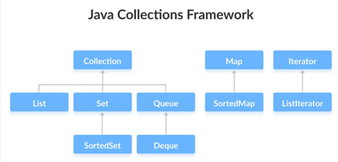

# Colecciones y Genericidad en Java

## Introducción a las Colecciones

Una **colección** es un objeto que agrupa otros objetos (llamados *elementos*).  
Por ejemplo, una lista de estudiantes, un conjunto de DNIs o un mapa de claves y valores.

El marco de colecciones ofrece:

- **Interfaces** que definen los tipos de colecciones (por ejemplo, `List`, `Set`, `Map`).  
- **Clases concretas** que implementan esas interfaces (`ArrayList`, `HashSet`, `HashMap`, etc.).  
- **Algoritmos genéricos** (en la clase `Collections`) para ordenar, buscar, mezclar, etc.

---

### Estructura del *Java Collections Framework*

```
Collection (interfaz raíz)
├── List       → Elementos ordenados, permiten duplicados
│   ├── ArrayList
│   ├── LinkedList
│   └── Vector / Stack
│
├── Set        → No permite duplicados
│   ├── HashSet
│   ├── LinkedHashSet
│   └── TreeSet
│
└── Queue      → Orden basada en prioridad o FIFO
    ├── PriorityQueue
    └── ArrayDeque

Map (interfaz separada, no hereda de Collection)
├── HashMap
├── LinkedHashMap
└── TreeMap
```
---



**Esquema básico del Java Collection Framework**


**[Componentes del JCF](03_java_collections_framework.md)**

---
## Genericidad en Java

Los **genéricos** son un mecanismo del lenguaje que permite definir clases, interfaces y métodos que operan sobre **tipos de datos parametrizados**, es decir, sin especificar el tipo concreto hasta su uso.

Los genéricos proporcionan **seguridad de tipos** y **reutilización de código**:  
se define una estructura general (por ejemplo, una lista) que puede almacenar distintos tipos de datos de forma segura.

**Ejemplo:**
```java
List<String> nombres = new ArrayList<>();
nombres.add("Ana");
// nombres.add(3); // ❌ error en compilación
String nombre = nombres.get(0); // ✅ sin necesidad de casting
```

### Ventajas

- Mayor **seguridad de tipos**: evita errores en tiempo de ejecución.  
- **Elimina conversiones** con `Object`.  
- Permite **reutilizar código** con distintos tipos.  

---

### Definición de una Clase Genérica

```java
public class Caja<T> {
    private T contenido;

    public void setContenido(T contenido) {
        this.contenido = contenido;
    }

    public T getContenido() {
        return contenido;
    }
}
```

Uso:
```java
Caja<String> caja1 = new Caja<>();
caja1.setContenido("Hola mundo");

Caja<Integer> caja2 = new Caja<>();
caja2.setContenido(42);
```

---

### Parámetros de tipo comunes

| Símbolo | Significado |
|----------|--------------|
| `T` | Tipo genérico (*Type*) |
| `E` | Elemento (*Element*) |
| `K` | Clave (*Key*) |
| `V` | Valor (*Value*) |
| `N` | Número (*Number*) |

---

### Genéricos con restricciones (bounded types)

Permiten limitar el tipo de datos que puede usarse:

```java
public <T extends Number> void mostrar(T num) {
    System.out.println(num.doubleValue());
}
```

✅ Acepta: `Integer`, `Double`, `Float`  
❌ No acepta: `String`

---

### Comodines (wildcards)

Los comodines (`?`) permiten flexibilidad en el tipo genérico:

```java
List<? extends Number> listaNumeros; // acepta List<Integer>, List<Double>, etc.
List<? super Integer> listaEnteros;  // acepta List<Integer>, List<Number>, List<Object>
```


