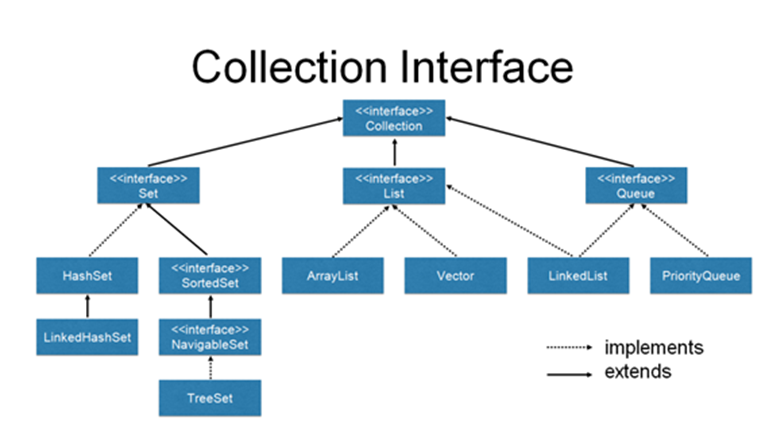

# Java Collections Framework (JCF)

Las **colecciones en Java** forman parte del **framework de colecciones de Java**, conocido como *Java Collections Framework* (**JCF**).  
Este framework está incluido en el paquete estándar de Java, específicamente en el paquete `java.util`.  
Fue introducido en la versión **1.2 de Java (Java 2)** y ofrece un conjunto de **interfaces, clases y métodos** para almacenar y manipular grupos de objetos (también llamados colecciones).

---

---

## Componentes del Java Collections Framework

### Interfaces

Las interfaces principales del framework son:

- **Collection** → La interfaz raíz de la mayoría de las colecciones.  
  Define las operaciones básicas comunes: añadir, eliminar, recorrer o consultar elementos.

- **List** → Extiende `Collection`. Define colecciones **ordenadas** que permiten **elementos duplicados**  
  (por ejemplo, `ArrayList`, `Vector`, `LinkedList`).

- **Set** → Extiende `Collection`. Define colecciones que **no permiten elementos duplicados**  
  (por ejemplo, `HashSet`, `LinkedHashSet`, `TreeSet`).

  - **SortedSet** → Extiende `Set`. Mantiene los elementos **ordenados** según el orden natural o un comparador.  
  - **NavigableSet** → Extiende `SortedSet`. Permite obtener elementos **mayores o menores** al dado, de forma eficiente.

- **Queue** → Extiende `Collection`. Define colecciones en las que los elementos se manejan en un **orden específico**,  
  como en una cola (por ejemplo, `LinkedList`, `PriorityQueue`).

---

### Clases de implementación

Clases concretas que **implementan** las interfaces principales:

- `ArrayList`, `Vector`, `LinkedList` → para **List**.  
- `HashSet`, `LinkedHashSet`, `TreeSet` → para **Set**.  
- `LinkedList`, `PriorityQueue` → para **Queue**.

 Orientación a Interfaces 

Los atributos de datos que hacen referencia a contenedores deben declararse usando tipos de datos propios de interfaces y no de clases.

 Por ejemplo, hacer declaraciones del tipo:

<strong>private List<Persona> = new ArrayList<>();</strong>

Y no del tipo:

private ArrayList<Persona> = new ArrayList<>();

---

### Notas sobre la jerarquía

- Las líneas **continuas** del diagrama indican que una **interfaz extiende otra** (`extends`).  
- Las líneas **punteadas** indican que una **clase implementa una interfaz** (`implements`).  
- `Collection` es la **interfaz base** de la jerarquía, mientras que `List`, `Set` y `Queue` son sus subinterfaces principales.  
- `Map` **no hereda** de `Collection`, pero forma parte del *Java Collections Framework*.

---

### Algoritmos

El framework también provee métodos para realizar **operaciones comunes** sobre colecciones, tales como:

- Búsqueda.  
- Ordenación.  
- Mezcla o manipulación de elementos.  

Estos métodos están disponibles en la clase de utilidades `Collections` del paquete `java.util`.

---
