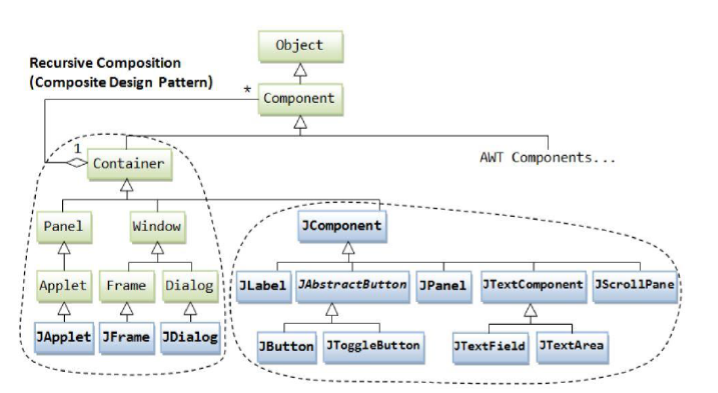
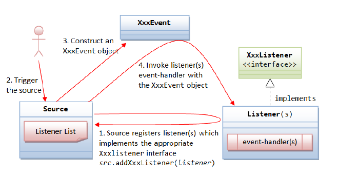
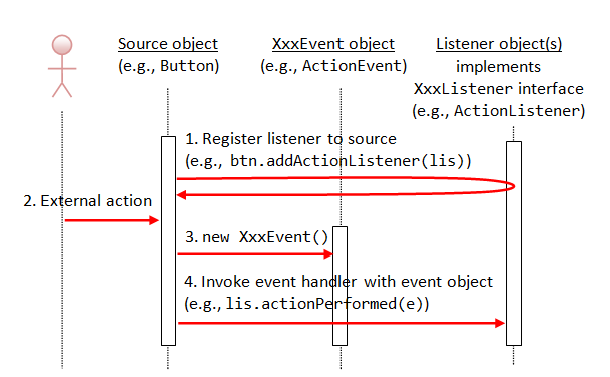

# Interfaz gráfica de usuarios

## Introducción a las interfaces gráficas

Una **interfaz gráfica de usuario (GUI)** permite la interacción con una aplicación mediante componentes visuales, como ventanas, botones, menús y cuadros de texto. En Java, las principales tecnologías para el desarrollo de interfaces gráficas han sido:

- **AWT (Abstract Window Toolkit)**: biblioteca básica de componentes dependientes del sistema operativo.
- **Swing**: conjunto de clases más flexible y portable, basada en el modelo MVC.
- **JavaFX**: tecnología moderna con soporte para interfaces enriquecidas y multimedia.

### Modelo MVC aplicado a interfaces
El modelo **Modelo-Vista-Controlador (MVC)** separa la lógica de negocio de la presentación.  
- **Modelo:** datos y lógica del programa.  
- **Vista:** elementos visuales que presenta el modelo.  
- **Controlador:** gestiona los eventos y coordina la interacción entre modelo y vista.

---

## La biblioteca Swing

**Swing** forma parte de las **Java Foundation Classes (JFC)** e incluye los componentes gráficos estándar de Java.

### Componentes de la JFC
- **Pluggable Look and Feel:** permite modificar la estética de las aplicaciones.
- **Accessibility API:** facilita la accesibilidad para usuarios con discapacidad.
- **Java 2D API:** mejora la calidad de los gráficos y textos en 2D.
- **Drag and Drop:** soporte para arrastrar y soltar elementos.

Las clases Swing se encuentran en el paquete `javax.swing`.

### Swing y JavaBeans
Los objetos Swing se basan en **JavaBeans**, lo que facilita su gestión desde IDEs visuales como NetBeans o IntelliJ IDEA.  
Cada bean define propiedades (con métodos *get* y *set*) y puede lanzar eventos mediante métodos como:

```java
void add<Evento>Listener(<Evento>Listener a);
void remove<Evento>Listener(<Evento>Listener a);
```

Los **Java Beans** son clases Java que siguen una serie de convenciones para que sus propiedades y eventos puedan ser gestionados automáticamente por herramientas de desarrollo (IDEs) y frameworks.

Una **propiedad** representa un atributo del objeto que puede ser leído o modificado mediante métodos públicos llamados **getters** y **setters**.

**Definición de propiedades**

Las propiedades se establecen mediante los métodos **getter** y **setter**, que siguen una nomenclatura estandarizada:

- `Tipo getXyz()`: devuelve el valor de la propiedad denominada *Xyz*.
- `void setXyz(Tipo v)`: establece la propiedad *Xyz* al valor *v*.

Si solo se implementa el método `getXyz()`, la propiedad se considera **de solo lectura**.

**Eventos en los Java Beans**

Además de las propiedades, los Java Beans pueden **lanzar eventos** y **registrar oyentes (listeners)** que respondan a dichos eventos.  
Esto permite la comunicación entre componentes en interfaces gráficas y otros sistemas de objetos.

**Patrón de métodos para gestión de eventos**

Para identificar los eventos que puede lanzar un objeto, se sigue este patrón:

```java
void add<Evento>Listener(<Evento>Listener a);
void remove<Evento>Listener(<Evento>Listener a);
```

Donde `<Evento>Listener` es el tipo del **gestor de evento** correspondiente (por ejemplo, `ActionListener`, `MouseListener`, etc.).

**Gestor de eventos**

Un **gestor de eventos** es un objeto que implementa los métodos que se ejecutarán cuando ocurra un evento.  
Algunos aspectos clave:

- Los gestores **deben estar registrados** en el objeto que lanza el evento.
- Un mismo gestor puede registrarse en **distintos objetos**.
- Se pueden añadir **varios gestores** para un mismo tipo de evento.

---

## Componentes básicos de Swing

Los elementos gráficos derivan de la clase **JComponent**.  




*Componentes Básicos Swing*


Estos componentes se agrupan en tres categorías:

### a) Contenedores de nivel superior
- `JFrame`: ventana principal de una aplicación.
- `JDialog`: cuadro de diálogo modal o no modal.
- `JApplet`: miniaplicación integrada en un navegador.

### b) Contenedores intermedios
- `JPanel`: contenedor básico.
- `JScrollPane`: añade barras de desplazamiento a otro componente.
- `JSplitPane`: divide el área en dos paneles ajustables.
- `JTabbedPane`: organiza componentes en pestañas.

### c) Componentes básicos y avanzados
- Botones (`JButton`), etiquetas (`JLabel`), campos de texto (`JTextField`), menús (`JMenu`).
- Componentes de información: barras de progreso, tooltips.
- Componentes avanzados: `JFileChooser`, `JColorChooser`, `JTable`, `JTree`.

<details>
  <summary>Ejemplo: “Hola Mundo” Swing</summary>
  <pre><code class="language-java">
import javax.swing.*;
import java.awt.*;

public class HolaMundo extends JFrame {
    public HolaMundo() {
        super("¡Hola mundo!");
        JLabel etiqueta = new JLabel("¡Hola mundo!");
        getContentPane().add(etiqueta);
        pack();
        setDefaultCloseOperation(JFrame.EXIT_ON_CLOSE);
        setVisible(true);
    }

    public static void main(String[] args) {
        new HolaMundo();
    }
}
</code></pre>
</details>


[Componentes](03_componentes_layouts_navegacion.md#componentes-swing)

---

## Gestión de eventos

Un **evento** representa una acción del usuario (clic, pulsación de tecla, etc.).  
Para gestionarlos, se definen **listeners** que implementan las interfaces correspondientes.

### Tipos de eventos
- `ActionEvent`: pulsar un botón, seleccionar una opción.
- `MouseEvent`, `MouseMotionEvent`: acciones con el ratón.
- `KeyEvent`: pulsaciones de teclas.
- `FocusEvent`: cambios de foco.

### Registro de eventos
```java
componente.addActionListener(new ActionListener() {
    public void actionPerformed(ActionEvent e) {
        // Código de respuesta
    }
});
```




*Registrando Eventos*


<details>
  <summary>Ejemplo: “Hola Mundo” con evento</summary>
  <pre><code class="language-java">import java.awt.event.*;
import javax.swing.*;

public class HolaMundoEvento extends JFrame {
    JLabel etiqueta = new JLabel("¡Hola mundo!");
    JButton boton = new JButton("Adiós");

    public HolaMundoEvento() {
        super("¡Hola mundo!");
        JPanel panel = new JPanel();
        panel.add(etiqueta);
        panel.add(boton);

        boton.addActionListener(new ActionListener() {
            public void actionPerformed(ActionEvent e) {
                etiqueta.setText("¡Adiós mundo!");
            }
        });

        getContentPane().add(panel);
        pack();
        setVisible(true);
    }

    public static void main(String[] args) {
        new HolaMundoEvento();
    }
}
</code></pre>
</details>




*Ejecutando Eventos*

---

## Diálogos y cuadros de mensaje

La clase `JOptionPane` permite crear fácilmente cuadros de diálogo estándar.

### Métodos principales
- `showMessageDialog`: muestra un mensaje.
- `showConfirmDialog`: solicita confirmación.
- `showInputDialog`: pide una entrada.
- `showOptionDialog`: combina las anteriores.

#### Ejemplo con JOptionPane
```java
JOptionPane.showMessageDialog(null, "¡Operación completada!");
```

### Clase JDialog
Permite crear diálogos personalizados, modales o no.

```java
import java.awt.*;
import javax.swing.*;

public class DialogoLogin extends JDialog {
    public DialogoLogin() {
        JTextField usuario = new JTextField(10);
        JPasswordField clave = new JPasswordField(12);
        setLayout(new FlowLayout());
        add(new JLabel("Usuario:"));
        add(usuario);
        add(new JLabel("Clave:"));
        add(clave);
        pack();
        setVisible(true);
    }
}
```

---

## Personalización de la interfaz

### Iconos, tooltips y bordes
```java
boton.setIcon(new ImageIcon("icono.png"));
boton.setToolTipText("Haz clic aquí");
boton.setBorder(BorderFactory.createTitledBorder("Acción"));
```

### Look and Feel
Permite modificar la apariencia de la aplicación.

```java
UIManager.setLookAndFeel(UIManager.getSystemLookAndFeelClassName());
SwingUtilities.updateComponentTreeUI(frame);
frame.pack();
```

Ejemplos de *Look and Feel*:
- `"javax.swing.plaf.metal.MetalLookAndFeel"`
- `"com.sun.java.swing.plaf.nimbus.NimbusLookAndFeel"`

---

## Buenas prácticas y consideraciones de diseño
- Mantener la lógica separada de la vista (MVC).
- Asegurar accesibilidad y coherencia estética.
- Utilizar `EventQueue.invokeLater()` para iniciar la GUI de forma segura.

---

