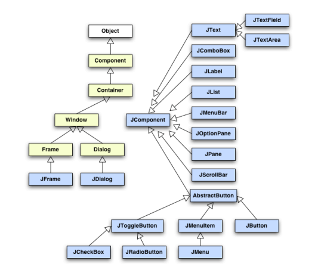

# Componentes, Layouts y Navegación

## Componentes Swing

Los **componentes Swing** son los elementos visuales que conforman la interfaz gráfica de una aplicación Java. Todos derivan de la clase `JComponent`, que a su vez hereda de `Container` y `Component`, dentro de la jerarquía de clases del paquete `javax.swing`.

Swing sigue un **patrón de diseño compuesto (Composite Design Pattern)**, lo que significa que un componente puede contener otros componentes, formando una jerarquía recursiva. Esto permite construir interfaces complejas a partir de componentes simples y reutilizables.

### Jerarquía básica de componentes

```text
Object
 └── Component
      └── Container
           ├── Window
           │    ├── Frame → JFrame
           │    └── Dialog → JDialog
           ├── Panel → JPanel, Applet → JApplet
           └── JComponent
                ├── JLabel
                ├── AbstractButton → JButton, JToggleButton, JCheckBox, JRadioButton
                ├── JTextComponent → JTextField, JTextArea
                ├── JScrollPane
                ├── JTable, JTree, JList
                └── JMenuBar, JMenuItem
```




*Jerarquía Básica de Componentes*


### Tipos principales de componentes

**Contenedores de nivel superior**
   - `JFrame`: ventana principal de la aplicación.
   - `JDialog`: cuadro de diálogo modal o no modal.
   - `JApplet`: miniaplicación integrada en un navegador.

**Componentes de entrada**
   - `JTextField`, `JTextArea`: campos de texto de una o varias líneas.
   - `JPasswordField`: campo de entrada para contraseñas.
   - `JCheckBox`, `JRadioButton`: selección binaria o exclusiva.

**Componentes de acción**
   - `JButton`, `JToggleButton`: disparan eventos de acción.
   - `JMenuBar`, `JMenu`, `JMenuItem`: permiten crear menús interactivos.

**Componentes de visualización**
   - `JLabel`: muestra texto o iconos.
   - `JTable`, `JTree`, `JList`: presentan estructuras de datos complejas.

**Componentes de organización**
   - `JPanel`: agrupa otros componentes.
   - `JScrollPane`, `JSplitPane`, `JTabbedPane`: controlan disposición y navegación.


<details>
  <summary>Ejemplo: Formulario de datos</summary>
  <pre><code class="language-java">import javax.swing.*;
import java.awt.*;

public class Formulario extends JFrame {
    public Formulario() {
        super("Registro de usuario");
        setLayout(new GridLayout(3, 2, 5, 5));

        add(new JLabel("Nombre:"));
        add(new JTextField(15));
        add(new JLabel("Correo electrónico:"));
        add(new JTextField(15));
        add(new JLabel("Contraseña:"));
        add(new JPasswordField(15));

        pack();
        setDefaultCloseOperation(EXIT_ON_CLOSE);
        setVisible(true);
    }

    public static void main(String[] args) {
        new Formulario();
    }
}
</code></pre>
</details>

---

## Layouts (Posicionamiento de componentes visuales)

El **Layout Manager** es el encargado de distribuir los componentes dentro de un contenedor. Permite definir la posición y el tamaño de cada elemento de manera automática, evitando cálculos manuales.

### Tipos más comunes de layouts

**BorderLayout**  
   Divide el espacio en cinco zonas: norte, sur, este, oeste y centro. Es el layout por defecto de `JFrame`.

**FlowLayout**  
   Coloca los componentes en fila, ajustándolos según el tamaño de la ventana. Es el layout por defecto de `JPanel`.

**BoxLayout**  
   Similar a `FlowLayout`, pero permite organizar componentes vertical u horizontalmente con mayor control sobre alineación y espacio.

**GridLayout**  
   Dispone los componentes en una tabla con filas y columnas del mismo tamaño.

**GridBagLayout**  
   Es el más flexible; permite que los componentes ocupen múltiples filas o columnas.

**CardLayout**  
   Muestra un panel a la vez, útil para implementar pantallas o formularios por pasos.

**GroupLayout**  
   Usado por los IDEs (NetBeans, IntelliJ) para diseñar interfaces gráficas de forma automática.

**null (disposición absoluta)**  
   Permite posicionar los componentes de forma manual (en píxeles). Es poco recomendable por su falta de adaptabilidad.


<details>
  <summary>Ejemplo combinado: BorderLayout + GridLayout</summary>
  <pre><code class="language-java">import javax.swing.*;
import java.awt.*;

public class VentanaLayouts extends JFrame {
    public VentanaLayouts() {
        super("Ejemplo Layouts");
        setLayout(new BorderLayout());

        JPanel centro = new JPanel(new GridLayout(2, 2));
        centro.add(new JButton("Uno"));
        centro.add(new JButton("Dos"));
        centro.add(new JButton("Tres"));
        centro.add(new JButton("Cuatro"));

        add(centro, BorderLayout.CENTER);
        add(new JLabel("Zona superior"), BorderLayout.NORTH);
        add(new JButton("Salir"), BorderLayout.SOUTH);

        pack();
        setVisible(true);
    }

    public static void main(String[] args) {
        new VentanaLayouts();
    }
}
</code></pre>
</details>


**Recomendación:** Utiliza los Layout Managers para garantizar que la interfaz se adapte correctamente a distintas resoluciones y sistemas operativos.

---

### Control del posicionamiento de los componentes

El **control del posicionamiento de los componentes** en una interfaz gráfica Swing permite ajustar la disposición y apariencia de los elementos visuales dentro de un contenedor.  
Además de utilizar los **gestores de diseño** (*Layout Managers*), es posible refinar el aspecto especificando el tamaño de los componentes mediante los métodos `setPreferredSize()` y `setMinimumSize()`, garantizando que mantengan dimensiones coherentes en diferentes entornos.  

En diseños que emplean `BoxLayout`, se puede controlar la **alineación** de los elementos con `setAlignmentX()` y `setAlignmentY()` para asegurar una correcta disposición horizontal o vertical.  
Asimismo, se pueden añadir **espacios entre componentes**, ya sea mediante márgenes, paneles intermedios o el uso de **bordes decorativos**, logrando una interfaz más clara, equilibrada y visualmente atractiva.


---

## Navegación entre componentes y pantallas

En aplicaciones con múltiples vistas, es necesario implementar mecanismos de **navegación** que permitan moverse entre diferentes pantallas, formularios o paneles.

### Estrategias comunes de navegación

**Uso de CardLayout**
   Este gestor de diseño permite tener varias “tarjetas” o paneles dentro de un mismo contenedor, mostrando solo una a la vez.

<details>
  <summary>Ejemplo: Navegación entre paneles con CardLayout</summary>
  <pre><code class="language-java">import javax.swing.*;
import java.awt.*;
import java.awt.event.*;

public class Navegacion extends JFrame {
    private CardLayout layout;
    private JPanel paneles;

    public Navegacion() {
        super("Navegación entre paneles");
        layout = new CardLayout();
        paneles = new JPanel(layout);

        JPanel panel1 = new JPanel();
        panel1.add(new JLabel("Pantalla 1"));
        JButton siguiente = new JButton("Siguiente");
        panel1.add(siguiente);

        JPanel panel2 = new JPanel();
        panel2.add(new JLabel("Pantalla 2"));
        JButton anterior = new JButton("Anterior");
        panel2.add(anterior);

        paneles.add(panel1, "1");
        paneles.add(panel2, "2");

        add(paneles);
        pack();
        setDefaultCloseOperation(EXIT_ON_CLOSE);
        setVisible(true);

        siguiente.addActionListener(e -> layout.show(paneles, "2"));
        anterior.addActionListener(e -> layout.show(paneles, "1"));
    }

    public static void main(String[] args) {
        new Navegacion();
    }
}
</code></pre>
</details>

## Selección de ficheros y menús

### Clase JFileChooser
Permite al usuario seleccionar archivos o directorios.

```java
JFileChooser f = new JFileChooser();
if (f.showOpenDialog(null) == JFileChooser.APPROVE_OPTION) {
    System.out.println("Fichero seleccionado: " + f.getSelectedFile());
}
```

### Menús
- `JMenuBar`: barra de menús.
- `JMenu`: submenús.
- `JMenuItem`: opciones.

#### Ejemplo
```java
JMenuBar barra = new JMenuBar();
JMenu menuArchivo = new JMenu("Archivo");
JMenuItem salir = new JMenuItem("Salir");
menuArchivo.add(salir);
barra.add(menuArchivo);
setJMenuBar(barra);
```

---

**Mostrar y ocultar paneles**
   Usando `setVisible(true/false)` se puede alternar entre paneles o secciones sin cambiar el layout.

**Diálogos modales y no modales**
   - Un **diálogo modal** bloquea la interacción con la ventana principal.
   - Un **diálogo no modal** permite mantener varias ventanas abiertas.

**Navegación mediante menús**
   Los menús (`JMenuBar`, `JMenu`, `JMenuItem`) permiten cambiar el contenido visible o abrir nuevas ventanas.

### Buenas prácticas
- Centralizar la gestión de la navegación en un controlador.
- Mantener el modelo de datos independiente de la vista.
- Evitar la creación excesiva de ventanas; preferir paneles intercambiables.

---