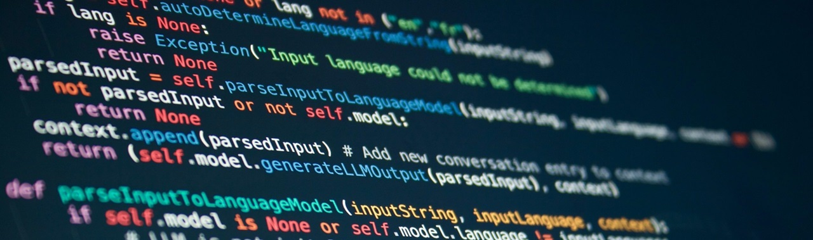

# Tecnologías de Programación

<h1 style="text-align: center;">Bienvenido a Tecnologías de Programación</h1>

## 📱 Tecnologías de programación

**Tecnologías de Programación** es una asignatura obligatoria del 2.º curso del Grado en Ingeniería Informática (1.er semestre, 6 ECTS). Su objetivo es dotar al alumnado de una formación avanzada en técnicas y paradigmas de programación que consolidan y amplían los conocimientos adquiridos en Fundamentos de Programación I y II.

La asignatura combina teoría, ejercicios prácticos y actividades de laboratorio. Se fomenta la aplicación de los conceptos en el diseño y desarrollo de programas, así como la reflexión crítica sobre las soluciones propuestas. El aprendizaje progresivo a lo largo de los tres bloques permite al estudiante adquirir competencias clave para desenvolverse en entornos profesionales donde se requieren aplicaciones modulares, interactivas y con capacidad de ejecución en paralelo o distribuida.

El curso se apoya en un enfoque práctico con **trabajos individuales y en equipo**, reforzando la capacidad de aplicar conceptos teóricos a problemas reales de programación. Esta asignatura constituye una base sólida para asignaturas posteriores relacionadas con la ingeniería del software, los sistemas distribuidos y la inteligencia artificial.

---

**Profesorado:**

- David Freire Obregón. Profesor de prácticas. Coordinador  
  
- Ignacio José López Rodríguez.
  
- María Dolores Afonso Suárez. 
  

